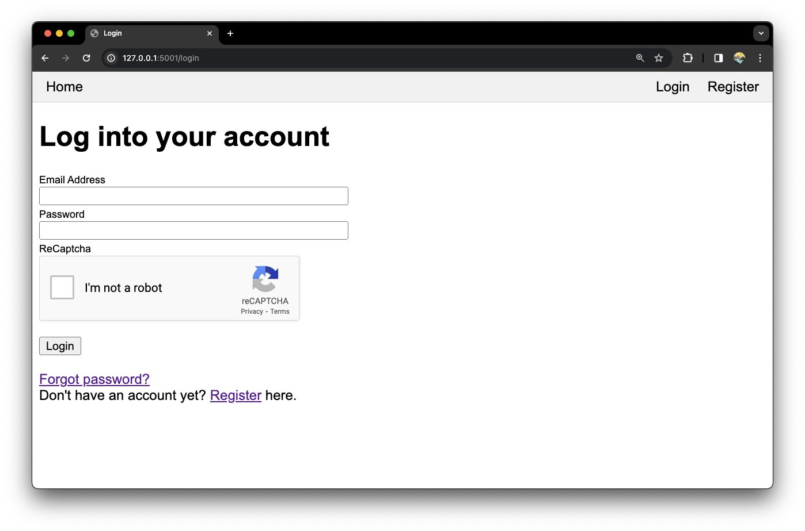

# Antique Web App

> A simple antique dealing web application focusing on implementation of cybersecurity features. Using Python3, Flask, SQLite, HTML/CSS/JS.



## Table of Contents

- [Table of Contents](#table-of-contents)
- [Introduction](#introduction)
- [Requirements](#requirements)
- [Setup](#setup)
- [Features](#features)
    - [The minimum viable product](#the-minimum-viable-product)
    - [Security features](#security-features)
    - [Vulnerability protection](#vulnerability-protection)
    - [Future work](#future-work)


## Introduction

This project was undertaken as the coursework assessment for the *Introduction to Computer Security* module during my third year at University.

**Project brief**: "In this part of the coursework, you will develop a secure web application for a local antique dealer named Lovejoy. Lovejoy wants a minimum viable product allowing customers to register and then request evaluations of potential antique objects. Lovejoy has many rivals in the antique business who may sometimes resort to underhand tactics and so is very concerned about the security of the application."

## Requirements

- Python version >= `3.11.0`
- Google ReCaptcha account.
- Email account for server to use when emailing users.

## Setup

Setup instructions should apply to all platforms (Windows, Linux, and macOS).

Make sure you have the [required](#requirements) version of Python installed.

1. Clone the repository.

    ```bash
    git clone https://github.com/TedAlden/antique-web-app
    cd antique-web-app
    ```

2. Install the required Python packages using pip.

    ```bash
    python3 -m pip install -r requirements.txt
    ```

3. Construct a database using the schema file.

    ```bash
    sqlite3 database.db < schema.sql
    ```

4. Optional: Create an admin account for the web application and note the email and password. These details can be changed as necessary within the script.

    ```bash
    python3 create_admin_account.py [EMAIL] [PASSWORD]
    ```

5. Create a `.env` file to configure application settings by copying the `.sample-env`.

    ```bash
    cp .sample-env .env
    ```

6. Configure a secret key for the Flask application in the `.env` file.

    ```dosini
    SECRET_KEY=
    ```

    A secret key can be randomly generated using the Python terminal command:

    ```bash
    python3 -c 'import secrets; print(secrets.token_hex())'
    ```

7. Configure Google ReCaptcha keys in the `.env` file.

    ```dosini
    RECAPTCHA_PUBLIC_KEY=
    RECAPTCHA_PRIVATE_KEY=
    ```

8. Configure mail server options in the `.env` file. The server and port are configured for Gmail by default but this can be changed as necessary.

    ```dosini
    MAIL_SERVER=smtp.googlemail.com
    MAIL_PORT=587
    MAIL_USE_TLS=True
    MAIL_USERNAME=
    MAIL_PASSWORD=
    ```

9. Run the application using Flask on port `5000`. You can change the port if necessary.

    ```bash
    flask run --port 5000
    ```

10. Visit the website via the address output in the terminal when running the application. This will probably be `127.0.0.1:5000`.

## Features

The goal of this coursework project was to deliver only a 'minimum-viable product' for an antique dealer. The focus was instead on vulnerability protection and the security features of the web application, as detailed below.

### The minimum viable product

- 'Login' and 'Register' account pages.
- 'Request an evaluation' page to submit a request with an image and description.
- 'View evaluations' page to see a user's own requests for evaluations.
- 'View all evaluations' page to see all users requests, only viewable to admins.

### Security features

- "Strong" passwords required at registration.
- Passwords are hashed and salted before being stored in the database.
- Passwords can be reset via email if forgotten.
- Users can delete their account and their associated evaluations.
- Email verification required for completing account registration.
- Two-factor authentication via Google Authenticator can be enabled for login.
- Security questions can be enabled for login.
- Google ReCaptcha required for login.

### Vulnerability protection

- SQL injection prevented via SQLite parameterised queries.
- XSS prevented using the Jinja2 template engine.
- CSRF prevented using CSRF tokens from Flask-WTF.
- File upload vulnerabilities are prevented by sanitising filenames and whitelisting only image formats.
- Brute force attacks prevented by limiting number of login attempts before locking a user account, at which point, the account must be re-activated via email.
- Botnet attacks prevented by requiring a successful ReCaptcha submission for login.
- Dictionary attack prevented by requiring strong passwords at registration.
- Rainbow table attack prevented by salting the password hashes in the database.

### Future work

- Evaluation images should not be served by an unauthenticated API route.
- Users should be able to change their email in case it becomes comprimised.
- Passwords could be checked against lists of popular or pwned credentials.
